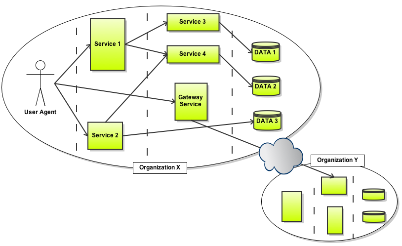

<!-- putting some comments here
this needs a lot more work :-) but is already more powerful than showoff
Needs to set and use more of the meta-declarations such as {:ruby}, {:incremental}, etc.
-->

<!-- slide cover title centered -->
# Service Oriented Architectures  
  
  
Styles, Technologies and Applications 
{:class="subhead"}

Cyril Rohr (IRISA - Equipe Myriads)  
Feb 4, 2010

<!-- slide title -->
# Agenda
* What problem are we trying to solve ?
* **Web** Services ?
* Architectural Styles - RPC vs Service-Oriented vs Resource-Oriented
* REST (Representation State Transfer): the style of the Web
* Technologies for building RESTful Web Services
* Real-World example: Grid5000 APIs
{:class="incremental"}

<!-- slide title center -->
# Problem
Complete, closed, monolithic applications
{:class="subhead"}

<!-- slide title center -->
# Objectives
Integration across application boundaries
{:class="subhead"}

<!-- slide center -->
# Objectives
Integration across organizational boundaries
{:class="subhead"}

<!-- slide center title -->
# Evolution towards Distributed Applications
* **Monolithic Applications**   
      
* duplication, high maintenance cost, no data sharing  
{:class="incremental"}

<!-- slide center title -->
# Evolution towards Distributed Applications
* **Applications sharing data**  
      
* fragile, duplication   
{:class="incremental"}

<!-- slide center title -->
# Evolution towards Distributed Applications
* **Applications sharing objects over the network**   
  

    
    
  
    
  

* complex, vendor lock in, tight coupling, often language dependent  
{:class="incremental"}

<!-- slide center title -->
# Evolution towards Distributed Applications
* **Service Oriented Architectures**    
     
* language independant, reusability, composability, loose-coupling  
{:class="incremental"}

<!-- slide title -->
# Software Services - definition
* Software services are units of functionality that exist at a service endpoint (**address**) that can be **remotely** accessed by clients. 
* Clients can use the service by communicating with this endpoint without having direct access to the actual code files that implement the service.
* Loosely coupled
* Avoid fine-grained interactions patterns.
{:class="incremental"}

<!-- slide -->
# Software Services - benefits
* Operations across organizations
* Language independent
* Reusability
* Standardization, leading to better interoperability
{:class="incremental"}

<!-- slide title center incremental -->
# **Web** Services ?

Term is often a catch-all for "services accessible on the web"

<!-- slide incremental -->
# **Web** Services ?
W3C
> a "web service" is "a software system designed to support interoperable machine-to-machine interaction over a network. 
> It has an interface described in a machine-processable format (specifically Web Services Description Language WSDL). 
> Other systems interact with the web service in a manner prescribed by its description using SOAP messages, typically conveyed using HTTP with an XML serialization in conjunction with other web-related standards."

Web Services (WS) are just one of the technologies available to create distributed architectures. A software service may, but need not be exposed as a Web Service.

<!-- slide incremental title -->
# Architectural Styles for Distributed Applications
* RPC (Remote Procedure Call)
* Service/Message Oriented
* Resource Oriented
{:class="incremental"}

  <table cellspacing="0">
    <tr><th>Style</th><th>Technologies</th></tr>
    <tr><td>Service Oriented Architecture</td><td class="highlighted">SOAP+WSDL</td></tr>
    <tr><td>Resource Oriented Architecture</td><td>HTTP+URI</td></tr>
    <tr><td>RPC</td><td>CORBA, DCOM, RMI, ...</td></tr>
  </table>

<!-- slide title incremental -->
# RPC
* CORBA, DCOM, RMI, XML-RPC...
  
* Language independency
* Apparent simplicity
{:class="incremental"}

<!-- slide incremental -->
# RPC - drawbacks
* Tight coupling (genrated client stub and server skeleton)
  
* No unique standard, leading to poor interoperability
* Poor scalability due to serialization/deserialization, statefulness, but also
* Hides the fact that objects are distributed, thus developer cannot make decisions according to objects locality.
{:class="incremental"}

<!-- slide title incremental -->
# Message Oriented Architecture
* Most often implemented using the WS-\* stack
  
* Web Services is a specific set of technologies for exposing Software Services:
  * the WSDL language for service description
  * the SOAP language as the message format
  * the HTTP protocol as the transport layer
  * the UDDI interface for service discovery
  {:class="incremental"}
{:class="incremental"}

<!-- slide incremental -->
# Message Oriented Architecture - WS-\*
Java method:

    public void myMethod(int x, float y);
  {:class="brush: java"}

## WSDL
    <message name="myMethodRequest">
        <part name="x" type="xsd:int"/>
        <part name="y" type="xsd:float"/>
    </message>
    <message name="empty"/>
    
    <portType name="PT">
        <operation name="myMethod">
            <input message="myMethodRequest"/>
            <output message="empty"/>
        </operation>
    </portType>
    
    <binding .../>  
  {:class="brush: xml; highlight: [8];"}

## SOAP
    <?xml version="1.0"?>
    <soap:Envelope xmlns:soap="http://www.w3.org/2001/12/soap-envelope" soap:encodingStyle="http://www.w3.org/2001/12/soap-encoding">
  
      <soap:Header>
      ...
      </soap:Header>
  
      <soap:Body>
        <myMethod>
            <x xsi:type="xsd:int">5</x>
            <y xsi:type="xsd:float">5.0</y>
        </myMethod>
      </soap:Body>
  
    </soap:Envelope>
  {:class="brush: xml;"}

    HTTP/1.1 200 OK
    Content-Type: application/soap+xml; charset=utf-8
    Content-Length: 234
  
    <?xml version="1.0"?>
    <soap:Envelope
    xmlns:soap="http://www.w3.org/2001/12/soap-envelope"
    soap:encodingStyle="http://www.w3.org/2001/12/soap-encoding">
  
    <soap:Body>
      <m:GetPriceResponse xmlns:m="http://www.w3schools.com/prices">
        <m:Price>1.90</m:Price>
      </m:GetPriceResponse>
    </soap:Body>

    </soap:Envelope>
  {:class="brush: xml;"}

<!-- slide incremental -->
# Message Oriented Architecture - benefits
* Kind of standardized, leading to better interoperability
* Easier to change the interface without breaking old clients
{:class="incremental"}

<!-- slide incremental -->
# Message Oriented Architecture - drawbacks
Complex, ever-changing specification    
    
WS-Security, WS-Policy, WS-SecurityPolicy, WS-PolicyAssertions, WS-PolicyAttachment, WS-Trust, WS-Privacy, WS-Routing, WS-Referral, WS-Coordination, WS-Transaction, WS-SecureConversation, WS-Federation, WS-Authorization, WS-Attachments, WS-Transfer, WS-ResourceTransfer, WS-ReliableMessaging, WS-Addressing, ...

<!-- slide incremental -->
# Message Oriented Architecture - drawbacks
* Specification written and pushed by big vendors (IBM, Microsoft, HP, Intel, SAP, Sun, etc.)
* Poor interoperability between vendor implementations, leading to vendor lock-in
* Most often, developers use early binding => stubs, proxy objects => tight-coupling
  
* Poor scalability: interactions are stateful, requires processing power to decode SOAP messages, difficult to load-balance or route requests based on the service endpoint (URI)
* UDDI is a failure
* Does not use HTTP as an application protocol, only as a transport protocol.
{:class="incremental"}

However, some advanced specs may be of interest (Security, QoS) if your environment requires it.

<!-- slide title incremental -->
# **RESTful** Services - concepts
* Representational State Transfer, in [Architectural Styles and the Design of Network-based Software Architectures](http://www.ics.uci.edu/~fielding/pubs/dissertation/top.htm) Roy T. Fielding (2000) 
  > The REST Web is the subset of the WWW (based on **HTTP**) in which agents provide uniform **interface semantics** -- essentially create (POST), retrieve (GET), update (PUT) and delete (DELETE) -- rather than **arbitrary or application-specific** interfaces, and manipulate **resources** only by the exchange of **representations**. 
  > Furthermore, the REST interactions are "**stateless**" in the sense that the meaning of a message does not depend on the state of the conversation.
  
{:class="incremental"}

<!-- slide incremental -->
# **RESTful** Services - concepts

## Resources
* Functionalities offered by the service are exposed under the form of resources (e.g. jobs, users, payments, orders, friends...)
  > A resource can be anything that has identity (RFC 2396)
* Real objects (user, site) or abstract concepts (status, payment)
* A resource may have **multiple representations**. E.g. a calendar may be represented using

        image/png, text/html, application/pdf, application/xml, text/calendar
{:class="incremental"}

## URI
* Uniquely identifies each resource using a standardized syntax (http://server.com/users/crohr, https://bank.com/accounts, ftp://ftp-server/document, mailto:cyril.rohr@irisa.fr, xmpp://crohr@jabber.grid5000.fr...). 
* Allows the use of **hypermedia** links to navigate from service to service.
{:class="incremental"}

<!-- slide incremental -->
# **RESTful** Services - concepts

## Unified interface
All resources share the same interface for transfering state between the client and the resource:

* a restricted set of well-defined operations (HTTP *verbs*)

        GET             fetch a resource
        POST            create a new resource
        PUT             update a resource
        DELETE          delete a resource
        ...
* a restricted set of standard [media types](http://www.iana.org/assignments/media-types/)

        text/html, image/png, application/xml...
  ...but you can define your own.

* a restricted set of [status codes](http://www.w3.org/Protocols/rfc2616/rfc2616-sec10.html)

        200 (OK), 201 (Created), 202 (Accepted), 
        303 (See Other), 304 (Not Modified), 
        400 (Bad Request), 404 (Not Found), 409 (Conflict), 
        500 (Internal Server Error)
        ...
{:class="incremental"}

<!-- slide incremental -->
# **RESTful** Services - concepts

## HTTP
* Client-Server protocol
  
* Stateless (each operation is self-sufficient)
* Cacheable
* Layered (intermediaries can be inserted between client and server, such as proxy, firewall, load-balancer, etc.)
  
{:class="incremental"}

HTTP may look like a messaging system at first glance, but it's not, it's a representation transfer system, no messages are ever sent back and forth, only **requests** and **responses** as **representations** of the **resources** modelled on the server.

<!-- slide incremental -->
# **RESTful** Services - benefits
* **Scalability**: cacheable requests (GET >> POST,PUT,DELETE), statelessness: requests are not bound to a specific server.
* **Interoperability**: the only thing that changes is the name of resources. Available HTTP verbs, status codes, etc. are always identical from one service to another => "given a URI, anyone already knows how to access it".
* **Addressability**: each resource is uniquely identified. 

        https://api.grid5000.fr/sid/grid5000/sites/rennes
* **Versioning** is easy: insert a version number in the URI (or use a custom HTTP Header), and dispatch accordingly to the correct server.
* **Control** meta-data (HTTP headers)
        
        Accept: application/json [format]
        Cache-Control: max-age=120 [cache]
        Accept-Encoding: gzip, deflate [compression]
        Accept-Language: us,en;q=0.5 [language]
        Accept-Charset: ISO-8859-15,utf-8;q=0.7,*;q=0.7 [charset]
        ...
        You can define your own: X-Api-Version, X-Api-User...

* Removes unnecessary complexity: headers, methods, status codes, media types are already standardized. The protocol is well documented, and in use since the Web exists. It's not another protocol on top of another protocol on top of another protocol on top of...
{:class="incremental"}

<!-- slide incremental -->
# **RESTful** Services - benefits
* **Security**: uses the inherent HTTP security model, certain methods to certain URIs can easily be restricted by firewall/proxy configuration.
* **Ubiquity**: every programming language can speak HTTP
* **Layered** architecture
  

    
    
    
    
  

{:class="incremental"}

<!-- slide incremental -->
# **RESTful** Services - constraints
* Requires to **carefully choose** the HTTP verb among those available

        GET     safe        (doesn't change the state of the resource on the server)
                idempotent  (same operation can be applied multiple times 
                             and will always return the same result)
                cacheable 
        PUT     idempotent 
        DELETE  idempotent 
        POST 
        ...

* **Stateless**: each communication must include all the material required for the server to understand the context.
* Do NOT disguise RPC calls as HTTP requests (Flickr API):
      
        GET /service?action=getUser&id=crohr&...
        
        POST /service
        {
          "action": "getUser",
          "id": "crohr",
          ...
        }
{:class="incremental"}

<!-- slide incremental -->
# **RESTful** Services - HowTo

* A bit of specification:
  * Choose your resources
  * Choose the supported HTTP verbs for each resource
  * Choose the supported media types
  * Choose the status codes that will be returned
  * Think about the link relationships between your resources
  {:class="incremental"}
* Use frameworks that encourage REST style: Sinatra (ruby), Restlet (java), Django & web.py (python)...
* Think about non-functional aspects
  * Authentication: use Basic-Auth, Digest or SSL Client Certificates. Avoid sessions and tokens stored in cookies.
  * Caching: max-age, public/private, ETags, Last-Modified
  * Request dispatching & Load balancing, based on URI/IP/Geolocation/Traffic congestion...
  {:class="incremental"}
{:class="incremental"}

<!-- slide incremental -->
# **RESTful** Services - Practical
authors, papers, reviewers

<!-- slide incremental -->
# **RESTful** Services - Real-World examples
## RESTful
* Amazon S3 API: http://docs.amazonwebservices.com/AmazonS3/latest/API/
* Netflix API: http://developer.netflix.com/docs/REST\_API\_Reference

## Not RESTful
* Digg API: http://digg.com/api/docs/overview
* Flickr API: 

<!-- slide incremental -->
# **RESTful** Services - Grid5000

<!-- slide title -->
# REST - Client Side Code

* Ruby

        require 'restclient'
        RestClient.get "https://api.grid5000.fr/sid/grid5000", :user => "crohr", :password => "whatever"
    {:class="brush: ruby"}
* cURL
        
        $ curl -X GET -kni https://api.grid5000.fr/sid/grid5000
    {:class="brush: bash"}
    
        HTTP/1.1 200 OK
        Date: Fri, 29 Jan 2010 12:12:14 GMT
        ETag: "ca5998adb91af61b9f9c57f2a26f71edebea5ffc"
        Allow: GET
        Cache-Control: public, must-revalidate
        Last-Modified: Mon, 25 Jan 2010 15:31:30 GMT
        Content-Length: 998
        Status: 200
        Content-Type: application/vnd.fr.grid5000.api.grid+json;level=1
        Age: 15023
        X-Cache: HIT from api-proxy.rennes.grid5000.fr

        {
          "uid": "grid5000",
          "type": "grid",
          "version": "1cd3a84ff0c25d269cb24ac294e29b0fe8c111c5",
          "links": [
            {
              "href": "/sid/grid5000/versions/1cd3a84ff0c25d269cb24ac294e29b0fe8c111c5",
              "title": "version",
              "rel": "member",
              "type": "application/vnd.fr.grid5000.api.Version+json;level=1"
            },
            {
              "href": "/sid/grid5000/versions",
              "title": "versions",
              "rel": "collection",
              "type": "application/vnd.fr.grid5000.api.Collection+json;level=1"
            },
            {
              "href": "/sid/grid5000",
              "rel": "self",
              "type": "application/vnd.fr.grid5000.api.Grid+json;level=1"
            },
            {
              "href": "/sid/grid5000/environments",
              "title": "environments",
              "rel": "collection",
              "type": "application/vnd.fr.grid5000.api.Collection+json;level=1"
            },
            {
              "href": "/sid/grid5000/sites",
              "title": "sites",
              "rel": "collection",
              "type": "application/vnd.fr.grid5000.api.Collection+json;level=1"
            }
          ]
        }
    {:class="brush: js; collapse: true; highlight: [1,3,4,5,6,7,8,9,10,11,17,42]"}

<!-- slide title -->
# REST - Server Side Code

  

<!-- slide title -->
# References
* RESTful Web Services, by Leonard Richardson and Sam Ruby, ISBN#978-0-596-52926-0
* http://tech.groups.yahoo.com/group/rest-discuss
* http://code.google.com/p/implementing-rest/
* HTTP/1.1 Method Definitions - http://www.w3.org/Protocols/rfc2616/rfc2616-sec9.html
* HTTP/1.1 Status Code Definitions - http://www.w3.org/Protocols/rfc2616/rfc2616-sec10.html
* HTTP/1.1 Header Field Definitions - http://www.w3.org/Protocols/rfc2616/rfc2616-sec14.html
* http://www.subbu.org/
* [Web Services architecture](http://www.w3.org/TR/ws-arch/)

* http://www.sinatrarb.com
