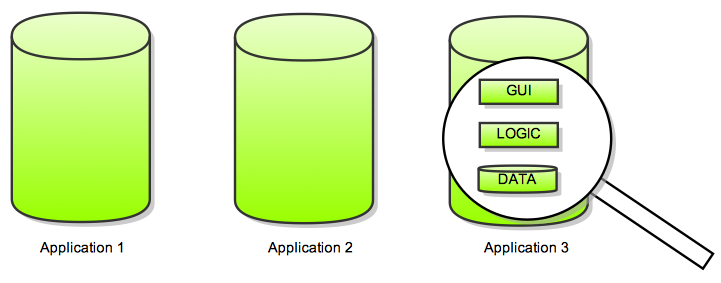

<!-- putting some comments here
this needs a lot more work :-) but is already more powerful than showoff
Needs to set and use more of the meta-declarations such as {:ruby}, {:incremental}, etc.
-->

<!-- slide cover title centered -->
# Service Oriented Architectures  
  
  
Styles, Technologies and Applications 
{:class="subhead"}

Cyril Rohr (IRISA - Equipe Myriads)
Feb 4, 2010

<!-- slide title -->
# Agenda
* Problem
* **Web** Services ?
* Styles: RPC vs Service-oriented vs Resource-Oriented
* REST : Representation State Transfer...
* Technologies
* Real-World example: Grid5000
{:class="incremental"}

<!-- 
  Concepts (intro, avantages, contraintes)
* Mise en oeuvre (client side, server side, tools)
* Aspects non fonctionnels 
-->

<!-- slide title center -->
# Problem
Complete, closed, monolithic applications
{:class="subhead"}

<!-- slide center -->
# Goal
Program integration across application => img
{:class="subhead"}
Program integration across organizational boundaries => img
{:class="subhead"}

<!-- slide title -->
# Evolution towards Distributed Applications
* monolithic (img) => duplication, high maintenance cost, no data sharing
* data export (img) => fragile, duplication
* operations over the network (img) => complex, vendor lock in, tight coupling, often language dependent
* service oriented architectures, composition, orchestration (img) => language independant, reusability, composability, loose-coupling

<!-- slide title -->
# Software Services - definition
* Software services exist at a service endpoint (**address**) that can be **remotely** accessed by clients. 
* Clients can use the service by communicating with this endpoint without having direct access to the actual code files that implement the service.
* Loosely coupled
* Avoid fine-grained interactions patterns.
{:class="incremental"}

<!-- slide -->
# Software Services - benefits
* Operations across organizations
* Language independent
* Reusability
* Standardization, leading to better interoperability
{:class="incremental"}

<!-- slide title -->
# **Web** Services ?
W3C
> a "web service" is "a software system designed to support interoperable machine-to-machine interaction over a network. 
> It has an interface described in a machine-processable format (specifically Web Services Description Language WSDL). 
> Other systems interact with the web service in a manner prescribed by its description using SOAP messages, typically conveyed using HTTP with an XML serialization in conjunction with other web-related standards."

Web Services is a specific set of technologies for exposing Software Services:
* the WSDL language for service description
* the SOAP language as the message format
* the HTTP protocol as the transport layer.
* the UDDI interface for service discovery.
{:class="incremental"}

<!-- slide -->
# **Web** Services ? - sidenote A virer
* A software service may, but need not be exposed as a Web Service.
* A system created by composing web services may not necessarily be regarded as having a Service Oriented Architecture unless its services conform to SOA design principles.
* Many current solutions created using web service solutions are not Service Oriented.
{:class="incremental"}

<!-- slide title -->
# Styles
* RPC (Remote Procedure Call)
* Service/Message oriented
* Resource oriented
{:class="incremental"}

<!-- slide incremental -->
# RPC (schema stub)
* CORBA, RMI, XML-RPC...
* Tight coupling (stubs, proxy)
* Poor interoperability
* No standard
* Poor scalability, in part due to processing required to serialize/deserialize from/to objects
* Hides the fact that objects are distributed, thus developer cannot make decisions according to objects locality.
{:class="incremental"}

DEAD END
{:class="big failure center"}

<!-- slide incremental -->
# Message oriented - I
* ajout de parametres ne casse pas les anciens clients
* Most often implemented using the WS-\* stack
* exemple de message SOAP
slide suivante:
* Complex, ever-changing specification
  
  WS-Security, WS-Policy, WS-SecurityPolicy, WS-PolicyAssertions, WS-PolicyAttachment, WS-Trust, WS-Privacy, WS-Routing, WS-Referral, WS-Coordination, WS-Transaction,    WS-SecureConversation, WS-Federation, WS-Authorization, WS-Attachments, WS-Transfer, WS-ResourceTransfer, WS-ReliableMessaging, WS-Addressing, ...
{:class="incremental"}

<!-- slide incremental -->
# Message oriented - II
* Poor interoperability between vendor implementations -> vendor lock-in
* revient a faire du RPC, tight-coupling
* Spec written and pushed by big vendors (IBM, Microsoft, HP, Intel, SAP, Sun, etc.)
* Does not use HTTP as an application protocol, only as a transport protocol (reinvents the wheel).
{:class="incremental"}

You may need the advanced Security/QoS specs, but will only work in a restricted environment.
In fact, most of it can be achieved with standard web technologies (SSL/TLS, PKI, Load balancer, Proxies, etc.)

ENTERPRISE COMPLIANT
{:class="big failure center"}

VENDOR CASH COW
{:class="big failure center"}

<!-- slide incremental -->
# **REST** Services - I
* Representation State Transfer [Architectural Styles and the Design of Network-based Software Architectures](http://www.ics.uci.edu/~fielding/pubs/dissertation/top.htm) Roy T. Fielding (2000) 
  > The REST Web is the subset of the WWW (based on **HTTP**) in which agents provide uniform **interface semantics** -- essentially create, retrieve, update and delete -- rather than arbitrary or application-specific interfaces, and manipulate **resources** only by the exchange of **representations**. 
  > Furthermore, the REST interactions are "**stateless**" in the sense that the meaning of a message does not depend on the state of the conversation.
{:class="incremental"}

image crohr, page html crohr, crohr.vcs, preparer exemples

<!-- slide incremental -->
# **REST** Services - II
* Removes unnecessary complexity: body, envelope, methods, all already exists in HTTP

PROVEN, SIMPLE, UBIQUITOUS
{:class="big success center"}

<!-- slide -->
# REST - HTTP
* document-based protocol
* client puts a document in an envelope and sends it to the server
* server returns a response document

* a set of predefined verbs
* headers
* body

An HTTP GET request for http://www.oreilly.com/index.html 

    GET /index.html HTTP/1.1 
    Host: www.oreilly.com 
    User-Agent: Mozilla/5.0 (X11; U; Linux i686; en-US; rv:1.7.12)... 
    Accept: text/xml,application/xml,application/xhtml+xml,text/html;q=0.9,... 
    Accept-Language: us,en;q=0.5 
    Accept-Encoding: gzip,deflate 
    Accept-Charset: ISO-8859-15,utf-8;q=0.7,*;q=0.7 
    Keep-Alive: 300 
    Connection: keep-alive 
  {:class="brush: plain"}

* The HTTP method
* The path (the address on the envelope): `/index.html`
This is the portion of the URI to the right of the hostname: here, http:// 
www.oreilly.com/index.html becomes “/index.html.” In terms of the envelope met- 
aphor, the path is the address on the envelope. In this book I sometimes refer to 
the “URI” as shorthand for just the path. 
The request headers 
These are bits of metadata: key-value pairs that act like informational stickers 
slapped onto the envelope. This request has eight headers: Host, User-Agent, 
Accept, and so on. There’s a standard list of HTTP headers (see Appendix C), and 
applications can define their own. 
The entity-body, also called the document or representation 
This is the document that inside the envelope. This particular request has no entity- 
body, which means the envelope is empty! This is typical for a GET request, where 
all the information needed to complete the request is in the path and the headers. 
The HTTP response is also a document in a envelope. It’s almost identical in form to 
the HTTP request. Example 1-6 shows a trimmed version of what the server at 
oreilly.com sends my web browser when I make the request in Example 1-5. 
Example 1-6. The response to an HTTP GET request for http://www.oreilly.com/index.html 
HTTP/1.1 200 OK 
Date: Fri, 17 Nov 2006 15:36:32 GMT 
6 | Chapter 1:!The Programmable Web and Its Inhabitants
Server: Apache 
Last-Modified: Fri, 17 Nov 2006 09:05:32 GMT 
Etag: "7359b7-a7fa-455d8264 
Accept-Ranges: bytes 
Content-Length: 43302 
Content-Type: text/html 
X-Cache: MISS from www.oreilly.com 
Keep-Alive: timeout=15, max=1000 
Connection: Keep-Alive 
<!DOCTYPE html PUBLIC "-//W3C//DTD XHTML 1.0 Transitional//EN" 
        "http://www.w3.org/TR/xhtml1/DTD/xhtml1-transitional.dtd"> 
<html xmlns="http://www.w3.org/1999/xhtml" xml:lang="en" lang="en"> 
<head> 
... 
<title>oreilly.com -- Welcome to O'Reilly Media, Inc.</title> 
... 
The response can be divided into three parts: 
The HTTP response code 
This numeric code tells the client whether its request went well or poorly, and how 
the client should regard this envelope and its contents. In this case the GET oper- 
ation must have succeeded, since the response code is 200 (“OK”). I describe the 
HTTP response codes in Appendix B. 
The response headers 
Just as with the request headers, these are informational stickers slapped onto the 
envelope. This response has 11 headers: Date, Server, and so on. 
The entity-body or representation 
Again, this is the document inside the envelope, and this time there actually is one! 
The entity-body is the fulfillment of my GET request. The rest of the response is 
just an envelope with stickers on it, telling the web browser how to deal with the 
document. 
The most important of these stickers is worth mentioning separately. The response 
header Content-Type gives the media type of the entity-body. In this case, the media 
type is text/html. This lets my web browser know it can render the entity-body as 
an HTML document: a web page. 
There’s a standard list of media types (http://www.iana.org/assignments/media- 
types/). The most common media types designate textual documents (text/html), 
structured data documents (application/xml), and images (image/jpeg). In other 
discussions of REST or HTTP, you may see the media type called the “MIME type,” 
“content type,” or “data type.” 

<!-- slide title -->
# REST - Client Side Code

* Ruby

        require 'restclient'
        RestClient.get "https://api.grid5000.fr/sid/grid5000", :user => "crohr", :password => "whatever"
    {:class="brush: ruby"}
* cURL
        
        $ curl -X GET -kni https://api.grid5000.fr/sid/grid5000
    {:class="brush: bash"}
    
        HTTP/1.1 200 OK
        Date: Fri, 29 Jan 2010 12:12:14 GMT
        ETag: "ca5998adb91af61b9f9c57f2a26f71edebea5ffc"
        Allow: GET
        Cache-Control: public, must-revalidate
        Last-Modified: Mon, 25 Jan 2010 15:31:30 GMT
        Content-Length: 998
        Status: 200
        Content-Type: application/vnd.fr.grid5000.api.grid+json;level=1
        Age: 15023
        X-Cache: HIT from api-proxy.rennes.grid5000.fr

        {
          "uid": "grid5000",
          "type": "grid",
          "version": "1cd3a84ff0c25d269cb24ac294e29b0fe8c111c5",
          "links": [
            {
              "href": "/sid/grid5000/versions/1cd3a84ff0c25d269cb24ac294e29b0fe8c111c5",
              "title": "version",
              "rel": "member",
              "type": "application/vnd.fr.grid5000.api.Version+json;level=1"
            },
            {
              "href": "/sid/grid5000/versions",
              "title": "versions",
              "rel": "collection",
              "type": "application/vnd.fr.grid5000.api.Collection+json;level=1"
            },
            {
              "href": "/sid/grid5000",
              "rel": "self",
              "type": "application/vnd.fr.grid5000.api.Grid+json;level=1"
            },
            {
              "href": "/sid/grid5000/environments",
              "title": "environments",
              "rel": "collection",
              "type": "application/vnd.fr.grid5000.api.Collection+json;level=1"
            },
            {
              "href": "/sid/grid5000/sites",
              "title": "sites",
              "rel": "collection",
              "type": "application/vnd.fr.grid5000.api.Collection+json;level=1"
            }
          ]
        }
    {:class="brush: js; collapse: true; highlight: [1,3,4,5,6,7,8,9,10,11,17,42]"}

<!-- slide title -->
# REST - Server Side Code

<!-- slide title -->
# Démo
![Grid5000][grid5000_img]

[grid5000_img]: images/grid5000.png